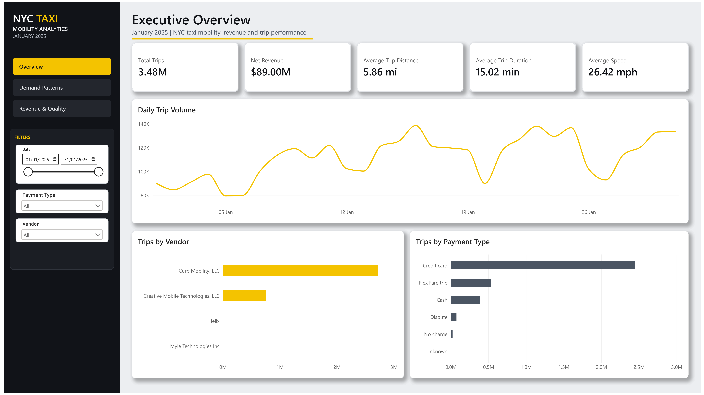
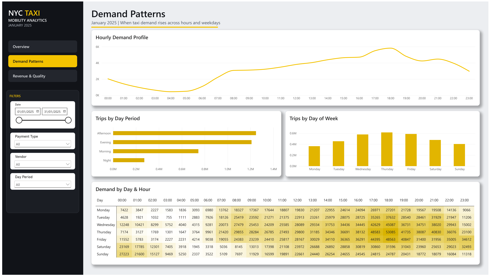
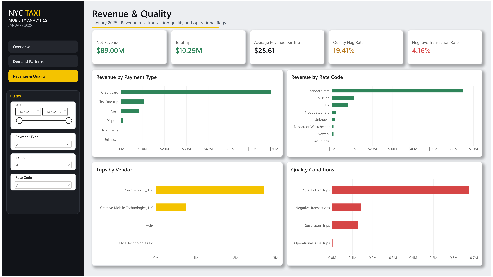

# Urban Mobility Analytics Pipeline

[](https://github.com/angel-wm/urban-mobility-analytics/actions/workflows/ci.yml)

An end-to-end data engineering and analytics portfolio project built on NYC
Yellow Taxi trip data using Python, PostgreSQL, Docker, SQL, pytest, GitHub
Actions, and Power BI.

The project covers reproducible data ingestion, data-quality validation, SQL
transformation, dimensional modeling, analytical marts, query optimization,
automated testing, continuous integration, and dashboard development.

## Current Status

The raw ingestion, SQL profiling, staging, analytics, analytical marts,
dimensional model, query optimization, automated testing, Power BI, and
continuous integration layers are complete.

The January 2025 Yellow Taxi dataset contains:

- 3,475,226 source records
- 20 source columns
- 4 Parquet row groups
- 0 technically rejected records during raw ingestion
- 3,475,204 records inside the expected January 2025 pickup period
- 22 records with pickup timestamps outside the expected period

The pipeline also includes a version-controlled 5,000-row development sample
for lightweight testing, database reconstruction, and CI validation.

The current PostgreSQL analytical and dimensional objects include:

- `staging.taxi_trips`
- `analytics.daily_trip_metrics`
- `analytics.hourly_trip_metrics`
- `marts.daily_mobility_summary`
- `marts.hourly_demand_profile`
- `marts.dim_ingestion`
- `marts.dim_date`
- `marts.dim_hour`
- `marts.dim_vendor`
- `marts.dim_rate_code`
- `marts.dim_payment_type`
- `marts.dim_store_and_fwd`
- `marts.fact_trip`

The analytics and summary marts provide daily and hourly metrics, conditional
aggregations, cumulative totals, period shares, rankings, previous-period
comparisons, and rolling averages.

The dimensional model implements a trip-level star schema with 3,480,226 fact
rows. It preserves the complete staging population, including the development
sample and records outside the expected analytical period.

See [`docs/staging_model.md`](docs/staging_model.md),
[`docs/analytics_and_marts.md`](docs/analytics_and_marts.md), and
[`docs/dimensional_model.md`](docs/dimensional_model.md) for detailed model
definitions and validation results.

## Architecture

```text
NYC TLC Yellow Taxi Parquet files
                |
                v
      Python ingestion pipeline
                |
                v
         PostgreSQL raw
                |
                v
       PostgreSQL staging
                |
        +-------+----------------------+
        |                              |
        v                              v
analytics.daily/hourly         dimensional model
validation views              dimensions + fact_trip
        |                              |
        |                              v
        |                     optimized mart views
        |                              |
        +------ reconciliation --------+
                                       |
                                       v
                                  Power BI
```

The staging layer provides a standardized analytical representation of the raw
records. From staging, the project maintains analytical views for independent
validation while also building the dimensional model used by the optimized
consumption marts and Power BI report.

## Power BI Dashboard

The Power BI report provides three analytical views built on top of the
PostgreSQL dimensional model and optimized marts.

The report and semantic model definitions are version-controlled in Power BI
Project (`.pbip`) format under the `powerbi/` directory.

### Executive Overview

High-level view of trip volume, revenue, average trip performance, vendor mix,
payment behavior, and daily mobility trends.



### Demand Patterns

Analysis of taxi demand across hours, day periods, weekdays, and combined
day-hour patterns.



### Revenue & Quality

Revenue composition together with transaction-quality indicators and
operational data-quality conditions.



## Technology Stack

- Python
- pandas
- NumPy
- PyArrow
- SQLAlchemy
- psycopg
- PostgreSQL
- Docker and Docker Compose
- Ruff
- pytest
- GitHub Actions
- Power BI

## Repository Structure

```text
urban-mobility-analytics/
├── .github/
│   └── workflows/
│       └── ci.yml
├── data/
│   ├── raw/
│   └── sample/
├── docs/
│   ├── Images/
│   └── powerbi_design_template/
├── notebooks/
├── powerbi/
│   ├── urban_mobility_analytics.Report/
│   ├── urban_mobility_analytics.SemanticModel/
│   └── urban_mobility_analytics.pbip
├── sql/
│   ├── analysis/
│   ├── analytics/
│   ├── ddl/
│   ├── dimensional/
│   ├── init/
│   ├── marts/
│   ├── optimization/
│   └── staging/
├── src/
│   ├── ingestion/
│   └── transformations/
├── tests/
│   └── integration/
├── .env.example
├── .gitignore
├── docker-compose.yml
├── pytest.ini
├── requirements.txt
├── requirements-dev.txt
└── requirements-lock.txt
```

## Raw Ingestion Pipeline

The ingestion pipeline:

1. Validates the source Parquet path.
2. Reads file metadata.
3. Checks whether the file was already processed.
4. Creates an ingestion audit record.
5. Processes the file one Parquet row group at a time.
6. Validates and normalizes source columns.
7. Loads records into PostgreSQL.
8. Compares source, read, and loaded row counts.
9. Marks the ingestion as completed, failed, or skipped.
10. Removes partial rows when an ingestion fails.

See [`docs/ingestion_pipeline.md`](docs/ingestion_pipeline.md) for the detailed
workflow.

## Dimensional Model

The dimensional layer implements a trip-level star schema in the PostgreSQL
`marts` schema.

Its grain is one row per `raw_trip_id`, with role-playing date and hour
dimensions and separate dimensions for ingestion, vendor, rate code, payment
type, and store-and-forward status.

The fact table preserves all 3,480,226 staging rows, including the 5,000-row
development sample and the 22 complete-ingestion trips outside the expected
January pickup period.

The model was validated for grain, row-count reconciliation, foreign-key
integrity, dimension coverage, operational attributes, financial measures, and
staging data-quality flags.

See [`docs/dimensional_model.md`](docs/dimensional_model.md) for the complete
design, execution process, validation evidence, and known limitations.

## Data Quality Approach

The raw layer preserves source values whenever they can be represented
technically.

Records with negative monetary values, zero distance, unusual timestamps, or
other analytical anomalies are not silently deleted during ingestion. These
conditions are classified through explicit data-quality flags in the staging
and dimensional layers.

This approach preserves source traceability while allowing downstream analyses
to apply metric-specific eligibility rules.

See [`docs/data_quality_rules.md`](docs/data_quality_rules.md) for the documented
data-quality rules and implementation details.

## Local Setup

The following steps reconstruct the development environment and analytical
database from the version-controlled repository contents.

### 1. Clone the repository

```powershell
git clone https://github.com/angel-wm/urban-mobility-analytics.git
cd urban-mobility-analytics
```

### 2. Create the environment file

Copy `.env.example` to `.env` and provide the local PostgreSQL credentials.

```powershell
Copy-Item .env.example .env
```

### 3. Create and activate the Python environment

```powershell
python -m venv .venv
.\.venv\Scripts\Activate.ps1
```

### 4. Install dependencies

For a reproducible development environment, install the pinned dependency set:

```powershell
python -m pip install --upgrade pip
pip install -r requirements-lock.txt
```

### 5. Start PostgreSQL

```powershell
docker compose up -d
```

Verify that the database container is healthy:

```powershell
docker compose ps
```

### 6. Create the database schemas and raw tables

```powershell
Get-Content -Raw .\sql\init\01_create_schemas.sql |
    docker compose exec -T db psql `
        -v ON_ERROR_STOP=1 `
        -U mobility_user `
        -d mobility_db

Get-Content -Raw .\sql\ddl\01_create_raw_tables.sql |
    docker compose exec -T db psql `
        -v ON_ERROR_STOP=1 `
        -U mobility_user `
        -d mobility_db
```

### 7. Load the development sample

```powershell
python -m src.ingestion.load_sample
```

The development sample provides a small reproducible dataset for validating the
database model without loading the complete monthly dataset.

### 8. Create the staging layer

```powershell
Get-Content -Raw .\sql\staging\01_create_staging_taxi_trips.sql |
    docker compose exec -T db psql `
        -v ON_ERROR_STOP=1 `
        -U mobility_user `
        -d mobility_db
```

### 9. Create the analytics layer

```powershell
Get-Content -Raw .\sql\analytics\01_create_daily_trip_metrics.sql |
    docker compose exec -T db psql `
        -v ON_ERROR_STOP=1 `
        -U mobility_user `
        -d mobility_db

Get-Content -Raw .\sql\analytics\03_create_hourly_trip_metrics.sql |
    docker compose exec -T db psql `
        -v ON_ERROR_STOP=1 `
        -U mobility_user `
        -d mobility_db
```

### 10. Create the base analytical marts

```powershell
Get-Content -Raw .\sql\marts\01_create_daily_mobility_summary.sql |
    docker compose exec -T db psql `
        -v ON_ERROR_STOP=1 `
        -U mobility_user `
        -d mobility_db

Get-Content -Raw .\sql\marts\03_create_hourly_demand_profile.sql |
    docker compose exec -T db psql `
        -v ON_ERROR_STOP=1 `
        -U mobility_user `
        -d mobility_db
```

### 11. Build the dimensional model

```powershell
Get-Content -Raw .\sql\dimensional\01_create_dimensional_tables.sql |
    docker compose exec -T db psql `
        -v ON_ERROR_STOP=1 `
        -U mobility_user `
        -d mobility_db

Get-Content -Raw .\sql\dimensional\02_load_dimensions.sql |
    docker compose exec -T db psql `
        -v ON_ERROR_STOP=1 `
        -U mobility_user `
        -d mobility_db

Get-Content -Raw .\sql\dimensional\03_load_fact_trip.sql |
    docker compose exec -T db psql `
        -v ON_ERROR_STOP=1 `
        -U mobility_user `
        -d mobility_db
```

### 12. Apply query optimizations

```powershell
Get-Content -Raw .\sql\optimization\01_create_query_optimization_indexes.sql |
    docker compose exec -T db psql `
        -v ON_ERROR_STOP=1 `
        -U mobility_user `
        -d mobility_db

Get-Content -Raw .\sql\optimization\02_optimize_mart_views.sql |
    docker compose exec -T db psql `
        -v ON_ERROR_STOP=1 `
        -U mobility_user `
        -d mobility_db
```

The optimization scripts are applied after the dimensional model because the
final mart definitions use the optimized fact-based query paths.

### 13. Validate the complete database model

```powershell
python -m pytest -m integration -v
```

The integration suite validates database schemas, analytical mart grain and
reconciliation, dimensional grain, row-count reconciliation, and referential
integrity.

## Main Commands

Check the PostgreSQL connection:

```powershell
python -m src.check_connection
```

Download the January 2025 dataset:

```powershell
python -m src.ingestion.download_data
```

Check the Parquet reader:

```powershell
python -m src.ingestion.check_parquet_reader
```

Load the development sample:

```powershell
python -m src.ingestion.load_sample
```

Load the complete month:

```powershell
python -m src.ingestion.load_month
```

Verify the completed monthly ingestion:

```powershell
python -m src.ingestion.check_month_ingestion
```

Run the default unit test suite:

```powershell
python -m pytest -v
```

Run PostgreSQL integration tests:

```powershell
python -m pytest -m integration -v
```

Run code-quality checks:

```powershell
ruff check src tests
ruff format --check tests
```

## Query Optimization

The query-optimization work introduces a selective index on
`marts.fact_trip.ingestion_id` and optimized definitions of the final daily
and hourly consumption marts.

The optimized summary views aggregate directly from the dimensional fact table
and dimensions, while the original staging-based `analytics` views remain
unchanged as independent reconciliation and validation references.

For the complete optimization rationale, benchmarks, implementation details,
and validation results, see
[`docs/query_optimization.md`](docs/query_optimization.md).

## Automated Tests

The project includes a pytest suite with 33 fast unit tests and 9 PostgreSQL
integration tests.

The default suite validates Python ingestion, transformation, Parquet,
configuration, download, and orchestration behavior without requiring
PostgreSQL.

The integration suite uses read-only PostgreSQL queries to validate dimensional
model invariants, analytical mart grain and reconciliation, and preservation of
the optimized fact-based mart definitions.

Integration tests are excluded from the default pytest run and are executed
explicitly with the `integration` marker.

See [`docs/automated_tests.md`](docs/automated_tests.md) for the complete test
strategy, coverage, commands, validation results, and limitations.

## Continuous Integration

The project uses GitHub Actions to validate code quality, unit tests, and the
PostgreSQL analytical model automatically.

The CI workflow runs on pushes to `main`, pull requests targeting `main`, and
manual executions through `workflow_dispatch`.

It contains two independent jobs:

- code-quality checks and 33 unit tests
- PostgreSQL 17 integration validation with 9 integration tests

The integration job reconstructs a clean PostgreSQL environment from the
version-controlled 5,000-row development sample and repository SQL scripts. It
does not depend on the developer's existing local database.

See [`docs/continuous_integration.md`](docs/continuous_integration.md) for the
complete workflow design, reconstruction process, validation results, and
limitations.

## Documentation

Detailed technical documentation is available under `docs/`:

- [`ingestion_pipeline.md`](docs/ingestion_pipeline.md) — ingestion architecture and execution flow
- [`data_quality_rules.md`](docs/data_quality_rules.md) — data-quality rules and flags
- [`sql_raw_data_profile.md`](docs/sql_raw_data_profile.md) — SQL profiling of the raw dataset
- [`staging_model.md`](docs/staging_model.md) — staging transformations and validation
- [`analytics_and_marts.md`](docs/analytics_and_marts.md) — analytical views and marts
- [`dimensional_model.md`](docs/dimensional_model.md) — dimensional model design and validation
- [`query_optimization.md`](docs/query_optimization.md) — query optimization and benchmarks
- [`automated_tests.md`](docs/automated_tests.md) — automated test strategy and coverage
- [`continuous_integration.md`](docs/continuous_integration.md) — GitHub Actions CI design

## Project Roadmap

- [x] Repository and local environment
- [x] Dockerized PostgreSQL
- [x] Initial data exploration
- [x] Raw ingestion pipeline
- [x] Idempotent file processing
- [x] Ingestion verification
- [x] SQL exploration and profiling
- [x] Staging transformations
- [x] Dimensional model
- [x] Analytical marts
- [x] Query optimization
- [x] Automated tests
- [x] Power BI dashboard
- [x] Continuous integration

## Dataset

This project uses NYC Taxi and Limousine Commission Yellow Taxi trip records.

The complete source files are not included in this repository. Only the
5,000-row development sample required for lightweight reconstruction and CI
validation is version-controlled.

## Author

Angel Miller — [@angel-wm](https://github.com/angel-wm)